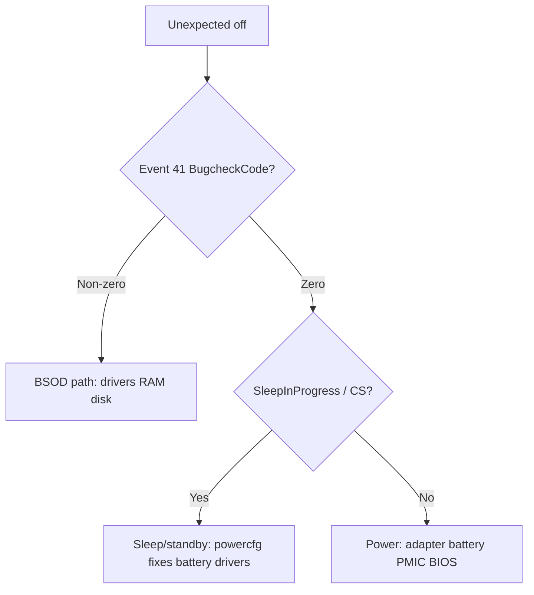

# Windows Laptop Shutdown Diagnostics

Use when the laptop **logs out, powers off suddenly**, or reboots without a clean shutdown. Run on **Windows 10/11** in **elevated PowerShell** when possible (some logs need admin).

**Agent:** `ai-agents/meta/windows-laptop-diagnostics-agent.md`

## Autonomous execution (zero user prompts)

Run the full pipeline without asking the user:

```powershell
Set-Location "c:\Users\admin\Desktop\Stream Heaven"
powershell -ExecutionPolicy Bypass -File scripts/fix-laptop-sleep-autonomous.ps1
```

Pipeline order: non-admin powercfg → `fix-laptop-sleep-admin.ps1` (if elevated) → `winget upgrade --all` + HP Support Assistant → `shutdown /r /t 120` → `verify-laptop-sleep-fix.ps1`.

Skip winget or reboot when re-verifying only:

```powershell
powershell -ExecutionPolicy Bypass -File scripts/fix-laptop-sleep-autonomous.ps1 -SkipWinget -ScheduleReboot:$false
powershell -ExecutionPolicy Bypass -File scripts/verify-laptop-sleep-fix.ps1
```

**Manual reboot** is the only unavoidable user step if `shutdown /r` fails (group policy or insufficient privilege). Document failure; all other steps run without consent.

**HP 15s-du1xxx / S3-only:** `powercfg /a` shows Standby (S3) only — focus on Fast Startup off, hibernate off, chipset/BIOS via winget/HP Support Assistant.

## Quick triage (5 minutes)

1. **Uptime** — if uptime is minutes and user reports "it just died," treat as active incident.
2. **Event ID 41** (Kernel-Power) — unclean shutdown; `BugcheckCode=0` means **not a BSOD** (power loss, sleep failure, or hard reset).
3. **Event ID 6008** — timestamps the *previous* unexpected shutdown.
4. **Event ID 1074** — last *planned* shutdown/restart (process + reason).

```powershell
$os = Get-CimInstance Win32_OperatingSystem
"Boot: $($os.LastBootUpTime) | Uptime: $((Get-Date)-$os.LastBootUpTime)"

Get-WinEvent -FilterHashtable @{LogName='System';Id=41;StartTime=(Get-Date).AddDays(-14)} -MaxEvents 10 |
  Select-Object TimeCreated

41,6008,1074 | ForEach-Object {
  "--- ID $_ ---"
  Get-WinEvent -FilterHashtable @{LogName='System';Id=$_;StartTime=(Get-Date).AddDays(-30)} -MaxEvents 8 -EA SilentlyContinue |
    ForEach-Object { $_.TimeCreated.ToString('yyyy-MM-dd HH:mm:ss') }
}
```

### Event 41 detail (root cause hints)

```powershell
Get-WinEvent -FilterHashtable @{LogName='System';Id=41;StartTime=(Get-Date).AddDays(-7)} -MaxEvents 5 |
  ForEach-Object {
    $x = [xml]$_.ToXml()
    $_.TimeCreated
    $x.Event.EventData.Data | Where-Object Name | ForEach-Object { "$($_.Name)=$($_.'#text')" }
    '---'
  }
```

| Field | Interpretation |
|-------|----------------|
| `BugcheckCode` ≠ 0 | Blue screen — note code, update drivers/BIOS |
| `BugcheckCode=0` | Power removed, PMIC reset, or sleep/hibernate path failed |
| `SleepInProgress` non-zero | Failure during or right after sleep/connected standby |
| `ConnectedStandbyInProgress=true` | Modern standby resume or drain issue |

## Power, sleep, and battery

```powershell
powercfg /query SCHEME_CURRENT SUB_SLEEP
powercfg /query SCHEME_CURRENT SUB_BUTTONS
Get-CimInstance Win32_Battery | Select-Object EstimatedChargeRemaining, BatteryStatus

$report = Join-Path $env:TEMP 'battery-report.html'
powercfg /batteryreport /output $report /duration 14
$report
```

**Battery health:** compare FULL CHARGE vs DESIGN CAPACITY in the HTML report. Below ~80% suggests replacement.

**Safe AC fixes** (reduces sleep/hibernate surprise power-offs while plugged in):

```powershell
powercfg /change monitor-timeout-ac 30
powercfg /change standby-timeout-ac 0
powercfg /change hibernate-timeout-ac 0
```

**Fast Startup** (can blur shutdown vs hibernate):

```powershell
Get-ItemProperty 'HKLM:\SYSTEM\CurrentControlSet\Control\Session Manager\Power' -Name HiberbootEnabled
# 1 = enabled — disable via Power Options if sleep/resume is unstable
```

## Disk and memory

```powershell
Get-PSDrive C | Select-Object Used, Free
Get-Volume -DriveLetter C | Select-Object HealthStatus, SizeRemaining, Size
Get-PhysicalDisk | Select-Object FriendlyName, MediaType, HealthStatus

$os = Get-CimInstance Win32_OperatingSystem
"Free GB: $([math]::Round($os.FreePhysicalMemory/1MB,2)) / Total GB: $([math]::Round($os.TotalVisibleMemorySize/1MB,2))"
```

- **&lt;10% free on C:**** risk of instability — free space before heavy dev work.
- **&lt;1 GB RAM free on 8 GB:** close apps; consider upgrade if frequent.

## Thermal

```powershell
Get-CimInstance MSAcpi_ThermalZoneTemperature -Namespace root/wmi -EA SilentlyContinue |
  ForEach-Object { [math]::Round(($_.CurrentTemperature - 2732)/10,1) }
```

If empty, use OEM utility or HWMonitor; overheating can trigger sudden off.

## Decision tree



## Escalation checklist

- [ ] Repeat Event 41 **multiple times per day** with `BugcheckCode=0` → test **AC-only**, new adapter, **battery calibration/replace**
- [ ] `SleepInProgress` set → disable Fast Startup; update **chipset/BIOS**; set **standby/hibernate AC to 0** (above)
- [ ] Disk **not Healthy** or SMART errors → backup immediately
- [ ] RAM consistently **&lt;500 MB free** → reduce load or add RAM

## Report template

Summarize for the user:

1. **Root cause** (power vs sleep vs BSOD vs resource)
2. **Fixes applied** (powercfg values, Fast Startup state)
3. **Hardware** (battery %, disk health, free RAM/disk)
4. **Key timestamps** (last 6008 + matching 41)
5. **Skill path:** `.cursor/skills/windows-laptop-diagnostics/SKILL.md`


**Lid close (AC) — avoid surprise sleep:**

```powershell
powercfg /SETACVALUEINDEX SCHEME_CURRENT SUB_BUTTONS LIDACTION 0
powercfg /SETACVALUEINDEX SCHEME_CURRENT SUB_SLEEP HYBRIDSLEEP 0
powercfg /SETACTIVE SCHEME_CURRENT
```

**Requires elevated PowerShell (document if denied):**

```powershell
Set-ItemProperty 'HKLM:\SYSTEM\CurrentControlSet\Control\Session Manager\Power' -Name HiberbootEnabled -Value 0
powercfg /h off
reg add "HKLM\SYSTEM\CurrentControlSet\Control\Power" /v PlatformAoAcOverride /t REG_DWORD /d 0 /f
```

**`powercfg /a` on HP 15s-du1xxx:** If only **Standby (S3)** is available and **S0 Low Power Idle** is not supported, Connected Standby is firmware-disabled — focus on S3 sleep path, Fast Startup, and chipset/BIOS updates.

**Agent:** `ai-agents/meta/windows-laptop-diagnostics-agent.md`


## Governance

Stream Heaven work is unrelated to host power issues; still document findings if shutdown interrupted **Phase 1** services (Docker/NestJS) — rerun smoke tests after stability returns.
