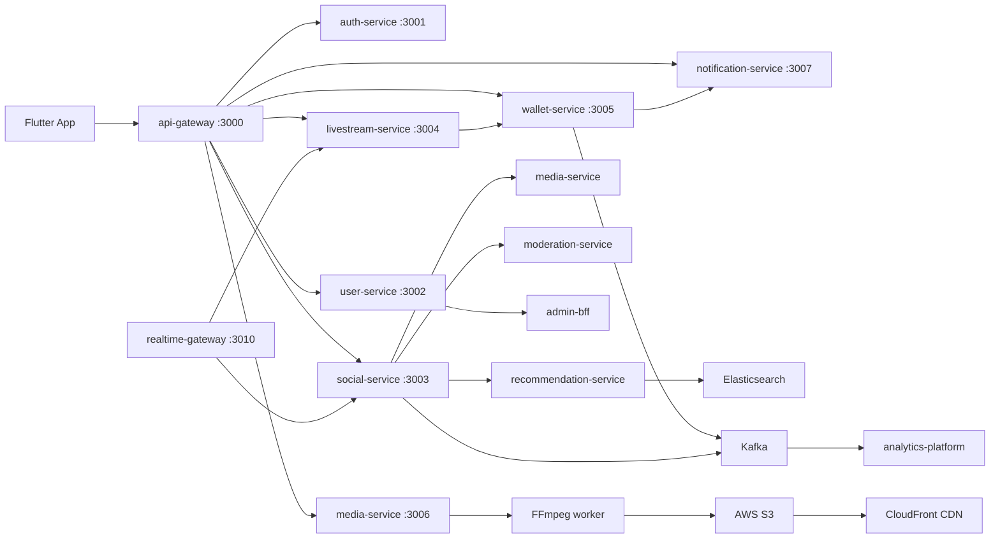
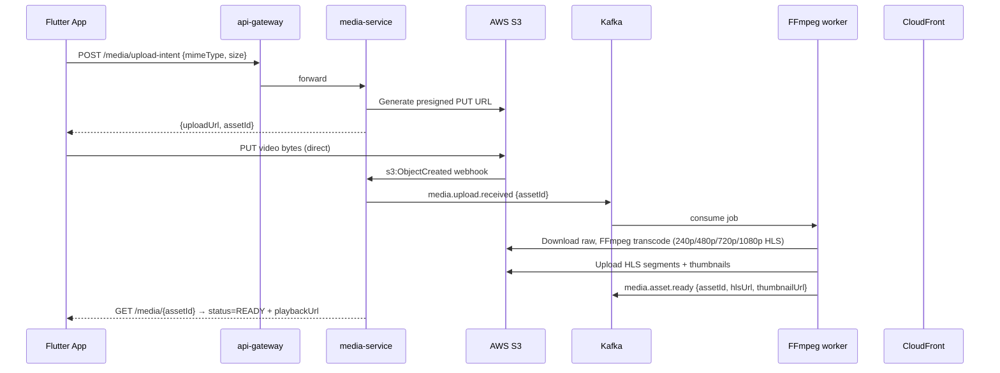

# Global Creator Ecosystem — Technical Architecture

> **Canonical architecture reference** for Stream Heaven's 20-module global creator platform.  
> Roadmap: [`docs/GLOBAL-CREATOR-ECOSYSTEM-ROADMAP.md`](GLOBAL-CREATOR-ECOSYSTEM-ROADMAP.md)  
> ADR: [`docs/adr/SH-002-global-creator-ecosystem-platform.md`](adr/SH-002-global-creator-ecosystem-platform.md)  
> Agent catalog: [`ai-agents/AGENT-REGISTRY.md`](../ai-agents/AGENT-REGISTRY.md)

**Last updated:** 2026-06-15  
**Phase 1 status:** ✅ Complete  
**Home Feed status:** ✅ Complete (16 agents, feed.v1.yaml, Flutter UI, tests pass)

---

## 1. Module Map — 20 User Modules

| # | Module | Status | Phase | Service | Contract |
|---|--------|--------|-------|---------|----------|
| 1 | Home Feed (Trending, Videos, Following, Celebrity, Create) | ✅ Done | 8 | social-service | `feed.v1.yaml` |
| 2 | TikTok-style vertical video | ✅ Shell | 8–9 | social-service | `social.v1.yaml` |
| 3 | Advanced video processing (FFmpeg, CDN) | 🔲 Phase 17 | 17 | media-service | `media.v1.yaml` |
| 4 | Creator post system (text, image, audio, community) | 🟡 Stub | 8 | social-service | `social.v1.yaml` |
| 5 | YouTube-grade adaptive delivery (HLS, DASH) | 🔲 Phase 17 | 17 | media-service | `media.v1.yaml` |
| 6 | Instagram-style creator profiles & dashboard | 🟡 Shell | 12 | user-service → creator-service | `user.v1.yaml` / `creator.v1.yaml` |
| 7 | AI recommendation engine | 🔲 Phase 14 | 14–15 | recommendation-service | `recommendation.v1.yaml` |
| 8 | Trending algorithm (velocity, regional) | 🟡 Stub | 15 | social-service | `feed.v1.yaml` |
| 9 | Celebrity verification & ecosystem | 🟡 Stub | 12, 20 | user-service + admin | `user.v1.yaml` |
| 10 | Live streaming (video + audio rooms, PK) | 🟡 Stub | 9–10 | livestream-service | `livestream.v1.yaml` |
| 11 | Gifting system (catalog, animations, leaderboards) | 🟡 Stub | 10–11 | wallet-service | `wallet.v1.yaml` |
| 12 | Wallet system (coins, IAP, UPI, withdraw) | 🟡 Stub | 11–13 | wallet-service | `wallet.v1.yaml` |
| 13 | Community system (fan clubs, polls, events) | 🔲 Phase 20 | 20 | social-service (ext) | `community.v1.yaml` |
| 14 | Notification system (FCM push, in-app inbox) | 🟡 Contract stub | 8, 18 | notification-service | `notification.v1.yaml` |
| 15 | AI content moderation | 🔲 Phase 20 | 20 | moderation-service | events |
| 16 | Anti-fraud (wallet, views, self-gift) | 🔲 Phase 20 | 13, 20 | trust-service | events |
| 17 | Creator analytics (DAU, retention, earnings) | 🔲 Phase 19 | 19 | analytics-platform | internal |
| 18 | Admin panel (celebrity, withdrawals, reports) | 🔲 Phase 20 | 20 | admin-bff | internal |
| 19 | Camera & media capture (1080p/4K, HDR) | 🟡 Shell | 8–9 | mobile SDK | native |
| 20 | Technology stack (K8s, Kafka, ES, LiveKit) | 🟡 Docker | 1–20 | infra | n/a |

**Legend:** ✅ Done · 🟡 Partial/Stub · 🔲 Planned

---

## 2. Service Boundaries

```
services/
  auth-service/         # Phase 1 ✅  — Firebase Auth, OTP, JWT
  user-service/         # Phase 1 ✅  — profiles, follows, devices
  api-gateway/          # Phase 1 ✅  — rate-limit, RBAC, proxy
  realtime-gateway/     # Phase 1 ✅  — Socket.IO, presence, pub/sub
  social-service/       # Phase 2+   — feed, posts, follow graph, community (ns)
  livestream-service/   # Phase 9+   — rooms, tokens, Agora, audio seats
  wallet-service/       # Phase 11+  — ledger, gifts, IAP/UPI, withdrawals
  media-service/        # Phase 17+  — presigned upload, transcode jobs, HLS
  notification-service/ # Phase 18+  — FCM dispatch, in-app inbox, templates
  moderation-service/   # Phase 20+  — reports queue, AI hooks, shadow ban
  recommendation-service/ # Phase 14+ — feature store, scoring, explore
  admin-bff/            # Phase 20+  — read models for ops console
```

> **Rule:** No new service until contract in `packages/shared-contracts/openapi/` is reviewed. No direct inter-service calls — route via `api-gateway` or async events.

---

## 3. Data Flow Diagrams

### 3.1 Overall System Data Flow



### 3.2 Video Upload Pipeline



### 3.3 Gift Send Flow

```mermaid
sequenceDiagram
  participant Viewer as Viewer (Flutter)
  participant Wallet as wallet-service
  participant RT as realtime-gateway
  participant Host as Host client
  participant Analytics as analytics-platform

  Viewer->>Wallet: POST /wallet/gifts/send {giftId, recipientUserId, context} Idempotency-Key
  Wallet->>Wallet: Debit viewer coins; credit creator escrow
  Wallet-->>Viewer: GiftReceipt 200
  Wallet->>RT: wallet.gift.sent Socket event
  RT->>Host: gift animation payload {giftSlug, quantity, senderHandle}
  RT->>Wallet: Update room leaderboard
  Wallet->>Analytics: engagement.gift.sent event
```

### 3.4 Creator Public Profile

```mermaid
sequenceDiagram
  participant App as Flutter App
  participant GW as api-gateway
  participant User as user-service
  participant Social as social-service

  App->>GW: GET /users/{handle}
  GW->>User: forward
  User-->>App: CreatorProfile {userId, handle, displayName, avatarUrl, isCelebrity, followerCount, followingCount, postCount}
  App->>GW: GET /social/feed?creatorId={userId}&limit=12
  GW->>Social: forward
  Social-->>App: FeedPage {items: PostThumb[]}
  App: Render grid with follow button; celebrity badge if isCelebrity
```

---

## 4. Phase Delivery Order

| Governance Phase | Modules (MVP → Production) | Key Agents | Gate |
|------------------|----------------------------|------------|------|
| **1** ✅ | Identity, profiles, contracts, realtime base | phase-1/* | `pnpm run phase1:complete` |
| **2–3** | Home feed tabs, post system MVP, TikTok feed | home-feed/*, social-feed-agent | Feed smoke tests pass |
| **8–9** | Reels ranking, live rooms MVP, Agora tokens | livestream-agent, reels-short-video-agent | Live smoke test |
| **10–11** | Gift animations, wallet ledger MVP | wallet-agent, gift-trigger-agent | Gift send test |
| **12–13** | Creator dashboard, creator public profile, payouts | creator-dashboard-agent, creator-public-profile-agent | Profile smoke test |
| **14–15** | AI recs + trending production formulas | recommendation-engine-agent, trending-engine-agent | A/B ranking CI |
| **16–17** | OTT delivery, FFmpeg pipeline, HLS | transcoding-agent, media-cdn-optimizer | Transcode CI |
| **18–20** | Notifications, community, moderation, fraud, admin, celebrity, crypto | notification-agent, community-manager-agent, ai-moderation-agent | Full platform test |

**Critical path:** Phase 1 → home feed → creator profile → live rooms → wallet/gifts → ML ranking → community/admin

---

## 5. Scoring Formulas (Product Specification)

> These are **canonical product specs**. Implementation must log individual component scores for debugging and A/B tests. Rule-based MVP first; ML ensemble in Phase 14+.

### 5.1 Feed Score (Module 7)

```
FinalScore =
  (UserInterestMatch   × 0.40)
+ (VideoQualityScore   × 0.25)
+ (WatchTimeScore      × 0.20)
+ (RecencyScore        × 0.10)
+ (DiversityScore      × 0.05)
```

**Signals:** watch time, completion rate, rewatch rate, shares, likes, comments, saves, follows, gifts, skip rate.  
**MVP:** `UserInterest` ≈ follow graph + recent likes; `Recency` = exp(-λ·age); others simplified constants.

### 5.2 Trending Score (Module 8)

```
TrendingScore =
  (EngagementRate   × 0.30)
+ (Velocity         × 0.25)
+ (WatchTime        × 0.25)
+ (CompletionRate   × 0.10)
+ (Recency          × 0.10)
```

**Velocity** = Δ(likes+shares+comments) over 1h sliding window (Redis sorted sets).  
**Anti-gaming:** cap single-user like velocity; celebrity boost capped at 1.5×.

### 5.3 Short-Video Rank Priority — Tie-Break Order

1. Watch time
2. Completion rate
3. Rewatch rate
4. Shares
5. Follows from video
6. Likes

### 5.4 Celebrity Verification Score (Module 9)

```
VerificationCandidate = true when ALL:
  followerCount >= 100_000 (IG|YT|X)
  AND engagementRate >= 0.02
  AND linkedProfileValid = true
  AND faceMatchScore >= 0.92
```

Final `celebrityVerified` flag requires **admin approval** (Phase 20 admin panel).

---

## 6. Tech Stack Alignment

| Layer | User Spec | Stream Heaven Decision | Phase |
|-------|-----------|------------------------|-------|
| Mobile | Flutter | ✅ `apps/mobile` — single binary, four-app flavors | 1+ |
| Web | React/Next.js | Admin panel (Phase 20) or Web Flutter | 20 |
| Backend | NestJS, TypeScript | ✅ `services/*` microservices | 1+ |
| AI / ML | Python, PyTorch | `ml-workers/` (Phase 14); gRPC → NestJS | 14+ |
| Database | PostgreSQL | ✅ per-service Postgres | 1+ |
| Cache | Redis | ✅ sessions, rank counters, Socket adapter | 1+ |
| Search | Elasticsearch | Phase 19 indexing; PostgreSQL FTS until then | 19+ |
| Queue | Kafka | Phase 11+ engagement events; Redis streams MVP | 11+ |
| Storage | AWS S3 | ✅ presigned PUT uploads | 1+ |
| CDN | CloudFront / Cloudflare | CloudFront for HLS; Cloudflare edges | 17+ |
| Video | FFmpeg, HLS | Async workers; DASH optional for OTT | 17+ |
| Live | WebRTC / Agora | **Agora primary**, LiveKit fallback (approved by ADR) | 9+ |
| Auth | Firebase Auth, OTP | ✅ via auth-service | 1 |
| Push | FCM | notification-service Phase 18 | 18+ |
| Monitoring | Prometheus, Grafana | Phase 5 infra agents | 5+ |
| Container | Docker → K8s | Docker compose local; K8s Phase 5 | 5+ |

---

## 7. Contract Map

| File | Service | Domain | Status |
|------|---------|--------|--------|
| `common.v1.yaml` | all | shared types | ✅ |
| `auth.v1.yaml` | auth-service | OTP, JWT | ✅ |
| `user.v1.yaml` | user-service | profiles, creator shell | ✅ |
| `social.v1.yaml` | social-service | feed, posts, engagement | ✅ |
| `feed.v1.yaml` | social-service | tabbed feed, FeedItem union | ✅ |
| `livestream.v1.yaml` | livestream-service | rooms, tokens, viewer count | ✅ stub |
| `wallet.v1.yaml` | wallet-service | balance, ledger, gifts, IAP/withdraw | ✅ stub |
| `media.v1.yaml` | media-service | upload intent, asset status, playback URL | ✅ stub (added SH-002) |
| `community.v1.yaml` | social-service | communities, memberships, polls | ✅ stub (added SH-002) |
| `notification.v1.yaml` | notification-service | in-app inbox, read markers | ✅ stub contract (service Phase 18) |
| `recommendation.v1.yaml` | recommendation-service | ranking features, explore | 🔲 Phase 14 |
| `creator.v1.yaml` | creator-service | verification, dashboard | 🔲 Phase 12 |
| `moderation.v1.yaml` | moderation-service | reports, auto-mod | 🔲 Phase 20 |

---

## 8. Agent Ecosystem Map

### Existing Home Feed Agents (16 — Done)

All under `apps/social-app/agents/home-feed/` — see `docs/HOME-FEED-SYSTEM-ARCHITECTURE.md`.

### Creator Profile & Dashboard Agents (NEW — Phase 12)

| Agent | Path | Purpose |
|-------|------|---------|
| creator-public-profile-agent | `apps/social-app/agents/creator/creator-public-profile-agent.md` | Public profile screen: avatar, bio, stats, post grid, follow |
| creator-post-composer-agent | `apps/social-app/agents/creator/creator-post-composer-agent.md` | Post creation flow: text, image, video, audio |
| creator-stats-dashboard-agent | `apps/social-app/agents/creator/creator-stats-dashboard-agent.md` | Creator metrics: views, followers, earnings |

### Video Pipeline Agents (NEW — Phase 17)

| Agent | Path | Purpose |
|-------|------|---------|
| video-upload-pipeline-agent | `apps/social-app/agents/video-pipeline/video-upload-pipeline-agent.md` | Presigned upload + transcode job orchestration |
| hls-playback-agent | `apps/social-app/agents/video-pipeline/hls-playback-agent.md` | HLS player integration, adaptive bitrate, offline |

### Audio Room Agents (NEW — Phase 9)

| Agent | Path | Purpose |
|-------|------|---------|
| audio-room-seat-agent | `apps/social-app/agents/audio-rooms/audio-room-seat-agent.md` | Seat model (8/16/24), speaker slots, audience |
| audio-room-gifting-agent | `apps/social-app/agents/audio-rooms/audio-room-gifting-agent.md` | Gift send surface within audio rooms |

### Notification Agents (NEW — Phase 18)

| Agent | Path | Purpose |
|-------|------|---------|
| push-notification-agent | `ai-agents/notifications/push-notification-agent.md` | FCM dispatch, templates, device token mgmt |
| in-app-notification-agent | `ai-agents/notifications/in-app-notification-agent.md` | In-app inbox, read/unread, badge count |
| notification-dispatch-agent | `ai-agents/notifications/notification-dispatch-agent.md` | Fan-out orchestration across push + in-app |

### Admin Panel Agents (NEW — Phase 20)

| Agent | Path | Purpose |
|-------|------|---------|
| admin-panel-bff-agent | `ai-agents/admin/admin-panel-bff-agent.md` | Admin BFF API, role gates, audit log |
| celebrity-approval-agent | `ai-agents/admin/celebrity-approval-agent.md` | Celebrity verification review queue |
| withdrawal-approval-agent | `ai-agents/admin/withdrawal-approval-agent.md` | Creator withdrawal approve/reject workflow |

### Community Agents (NEW — Phase 20)

| Agent | Path | Purpose |
|-------|------|---------|
| community-api-agent | `apps/social-app/agents/community/community-api-agent.md` | Community CRUD, membership, roles |
| fan-club-agent | `apps/social-app/agents/community/fan-club-agent.md` | Fan club tiers, exclusive content, perks |

### Analytics Stub Agents (NEW — Phase 19)

| Agent | Path | Purpose |
|-------|------|---------|
| creator-analytics-dashboard-agent | `apps/social-app/agents/analytics/creator-analytics-dashboard-agent.md` | Flutter creator dashboard: views, watch-time, earnings charts |

---

## 9. Flutter Module Map

```
apps/mobile/lib/features/
  auth/             # Phase 1 ✅ — OTP, Firebase, login screen
  profile/          # Phase 1 ✅ — account settings, display name
  social/
    presentation/
      home/         # Phase 8 ✅ — SocialHomeShell, tabs, feed
      feed_screen/  # Phase 2 — legacy feed screen
      creator/      # Phase 12 🟡 — PUBLIC creator profile page (added now)
        domain/     #   CreatorProfileModel
        data/       #   mock data + repository stub
        providers/  #   creatorProfileProvider
        widgets/    #   CreatorStatsBar, CreatorPostGrid
        creator_profile_screen.dart
  livestream/       # Phase 9 — live rooms stub
  home_feed/        # alias → social/presentation/home
```

---

## 10. Security & Compliance Non-Negotiables

1. **No secrets in code** — AWS Secrets Manager + `.env` (gitignored); `env_config.dart` reads env vars only
2. **RBAC** — roles: `USER`, `CREATOR`, `CELEBRITY`, `MODERATOR`, `ADMIN`; enforced in `api-gateway`
3. **Idempotency** — all wallet mutations require `Idempotency-Key` header
4. **Age gate** — wallet/gifting requires `age >= 18` check on backend; flag user profile
5. **India DPDP** — user data deletion via `DELETE /users/me`; consent log per action
6. **Crypto-ready, not crypto-live** — `wallet.v1` reserves `chainId`, `walletAddress`, `web3TxHash` fields; no on-chain logic until Phase 20 + legal sign-off
7. **Content moderation** — all user-uploaded media scanned before `READY` status; social posts go through moderation pipeline (Phase 20)

---

## 11. Observability Hooks

All services must emit:
- `GET /health` → `{status: "ok", version, uptime}`  
- Prometheus metrics at `GET /metrics`
- Structured JSON logs with `requestId`, `userId`, `appId`, `durationMs`
- OpenTelemetry spans for external calls (Agora, S3, Firebase, Payment Gateway)

---

## 12. MVP Milestone Summary

**Recommended first revenue-ready slice:**  
User can **log in → scroll home feed → watch short video → view creator profile → follow creator → join live room → send gift → see wallet balance**  
Phases 1–3 + 8–12: ~6 phases implementing ~8 of 20 modules at MVP depth.

---

*Stream Heaven Global Creator Ecosystem Architecture v1.0 — 2026-06-15*
