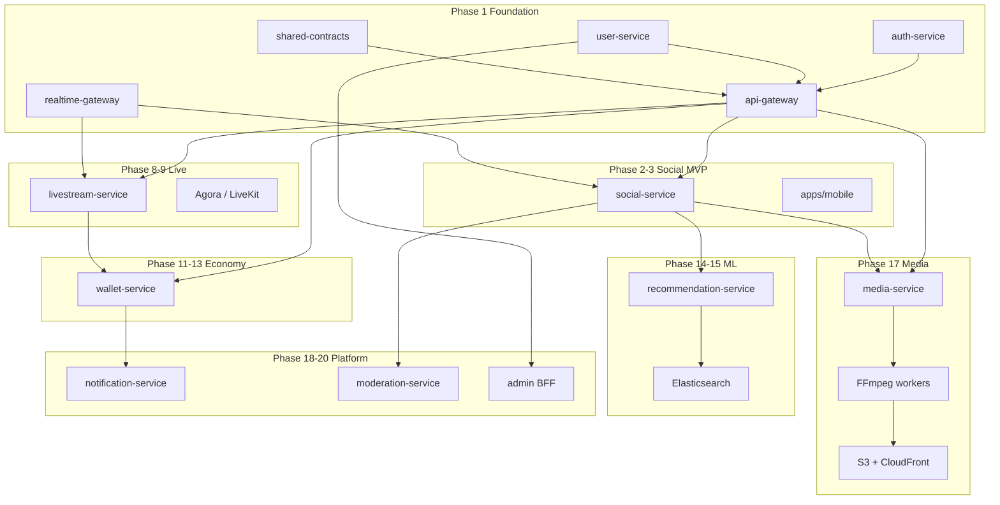
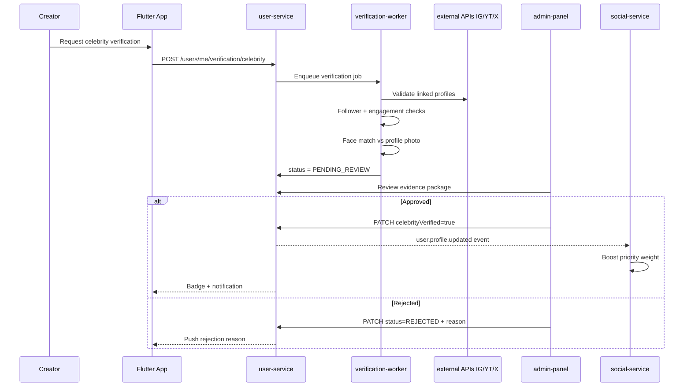
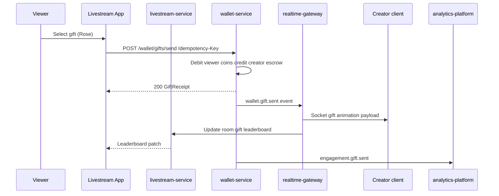
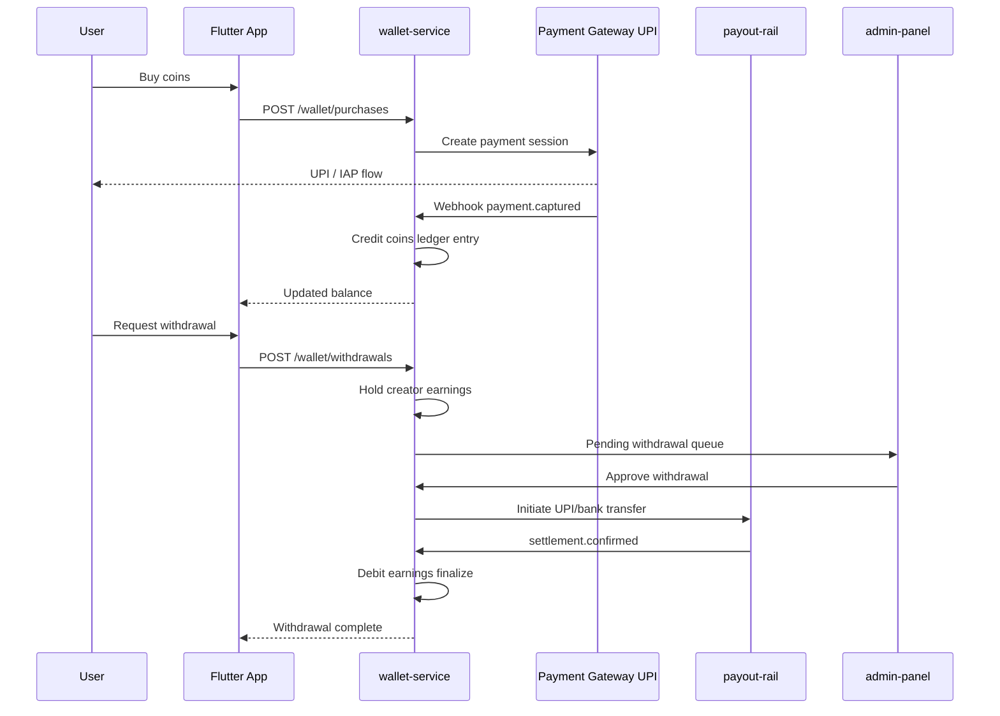

# Global Creator Ecosystem — Phased Roadmap

> Maps the user's **20 core platform modules** onto Stream Heaven governance, services, contracts, and agents.  
> Architecture decisions: [`docs/adr/SH-002-global-creator-ecosystem-platform.md`](adr/SH-002-global-creator-ecosystem-platform.md)

**Last updated:** 2026-06-15  
**Phase 1 status:** ✅ Implemented (auth, user, gateway, realtime, mobile shell)  
**North star:** One identity, four apps, Indian-first scale globally

---

## Executive Summary

| Category | Count | Notes |
|----------|-------|-------|
| Modules with Phase 1 foundation | 3 | Identity (via SH-001), partial tech stack, realtime base |
| Modules with agents + contracts (stubs) | 14 | social, livestream, wallet stub, economy, safety, growth-ai |
| Modules requiring new services | 8 | media pipeline workers, notification, moderation, recommendation, admin BFF, community extensions |
| Full production across all 20 modules | Phases 1–20 | MVP slice target: **Phases 2–3 + 8–12** |

---

## Module Mapping (20 → Stream Heaven)

| # | User module | Existing assets | Gaps | SH phase | MVP scope | Production scope |
|---|-------------|-----------------|------|----------|-----------|------------------|
| 1 | **Home feed** (Trending, Videos, Following, Celebrity, Create) | `social.v1.yaml` `/social/feed`, `social-feed-agent`, `feed-ranking-agent`, `apps/mobile` feed screen | Tab-specific rankers, multi-content-type envelope, celebrity tab | **8** | Single Following feed + Create stub | All tabs + mixed media types |
| 2 | **TikTok-style video** | `reels-short-video-agent`, `watch-time-agent`, `social.v1` posts | Vertical player, preload, swipe, progress events | **8–9** | In-feed short video playback | Full engagement + gift on video |
| 3 | **Advanced video processing** | `transcoding-pipeline-agent`, `media-pipeline/*` agents | FFmpeg workers, S3 pipeline, scan step, job queue | **17** | Upload + 720p HLS | 240p–4K ladder, thumbnails |
| 4 | **Creator post system** | `social.v1` create post, filters/effects agents | Video/image/audio/community post types, editor SDK | **8** | Text + image post | Full creation suite |
| 5 | **YouTube-grade delivery** | `media-cdn-optimizer`, Cloudflare in stack docs | Adaptive HLS, prefetch, retention analytics | **17** | CDN playback URLs | Full analytics pipeline |
| 6 | **Instagram-style creator system** | `user.v1.yaml`, `creator-profile-agent`, `profile-service` | Creator badge, dashboard metrics API | **12** | Public profile + follow counts | Dashboard + earnings |
| 7 | **AI recommendation engine** | `recommendation-engine-agent`, `feed-ranking-ml-agent` | Feature store, online scoring service | **14–15** | Rule-based feed score | ML ensemble per formula below |
| 8 | **Trending algorithm** | `hashtag-trending-agent`, `trending-engine-agent` | Velocity windows, regional trending | **15** | Simple engagement sort | Full trending formula |
| 9 | **Celebrity ecosystem** | `creator-verification-agent`, RBAC `CREATOR` | OAuth proof links, admin approval, priority boost | **12, 20** | Manual badge flag | Full verification flow (diagram below) |
| 10 | **Live streaming** | `livestream.v1.yaml`, `livestream-service` scaffold, Agora agents | RTC tokens, co-host, PK, audio seats | **9–10** | Go live + chat | Multi-guest, PK, audio rooms |
| 11 | **Gifting system** | `gift-*` agents, cosmetics domain | Gift catalog, send API, animations, leaderboards | **10–11** | Rose gift in live room | Full catalog + FX |
| 12 | **Wallet system** | `wallet-agent`, economy agents | **`wallet-service`**, `wallet.v1.yaml` stub | **11–13** | Coin balance + history | IAP, UPI, withdraw |
| 13 | **Community system** | `fan-community-agent`, `community-*` agents | Communities API, polls, events | **20** | — | Public/private communities |
| 14 | **Notification system** | `notification-agent`, FCM in architecture | `notification-service`, push templates | **8, 18** | In-app inbox stub | Real-time FCM + Socket |
| 15 | **AI moderation** | `content-moderation-pipeline`, `ai-moderation-agent` | Auto-mod hooks on upload/post | **20** | Report/block (social.v1) | ML + manual queue |
| 16 | **Anti-fraud** | `fraud-detection-agent`, `ad-fraud-agent` | Risk scores on wallet/views | **13, 20** | — | Self-gift, bot detection |
| 17 | **Analytics** | `analytics-platform/*`, `event-tracking-agent` | Kafka → warehouse, creator metrics | **19** | Basic view counters | DAU/MAU, retention |
| 18 | **Admin panel** | Safety/governance agents | Admin BFF, celebrity approve UI | **20** | — | Full ops console |
| 19 | **Camera & media requirements** | Flutter mobile shell | 1080p/4K capture, audio codecs | **8–9** | 1080p record | HDR, noise suppression |
| 20 | **Technology stack** | Phase 1 stack implemented | Kafka, ES, K8s prod, LiveKit | **1–20** | Docker local | K8s + managed services |

---

## Ranking Formula Spec References

These formulas are **product specifications**. Implementation must log component scores for debugging and A/B tests.

### Feed score (Module 7)

```
FinalScore =
  (UserInterestMatch × 0.40)
+ (VideoQualityScore × 0.25)
+ (WatchTimeScore × 0.20)
+ (RecencyScore × 0.10)
+ (DiversityScore × 0.05)
```

**User signals:** watch time, completion rate, rewatch rate, shares, likes, comments, saves, follows, gifts, skip rate.

**MVP (Phase 8):** `UserInterest` ≈ follow graph + recent likes; `Recency` = time decay; others simplified.

### Trending score (Module 8)

```
TrendingScore =
  (EngagementRate × 0.30)
+ (Velocity × 0.25)
+ (WatchTime × 0.25)
+ (CompletionRate × 0.10)
+ (Recency × 0.10)
```

**Signals:** likes, comments, shares, gifts, watch time, completion, follow gain.

### Short-video rank priority (Module 2 — tie-break order)

1. Watch time  
2. Completion rate  
3. Rewatch rate  
4. Shares  
5. Follows  
6. Likes  

---

## Contract-First API Boundaries

All paths under `/v1/` via `api-gateway`. New domains require OpenAPI in `packages/shared-contracts/openapi/` before NestJS implementation.

| Contract file | Service | Module coverage | Status |
|---------------|---------|-----------------|--------|
| `common.v1.yaml` | all | shared types | ✅ |
| `auth.v1.yaml` | auth-service | identity | ✅ |
| `user.v1.yaml` | user-service | profiles, creator shell | ✅ |
| `social.v1.yaml` | social-service | feed, posts, graph, community (extend) | ✅ stub |
| `livestream.v1.yaml` | livestream-service | live, audio rooms | ✅ stub |
| `wallet.v1.yaml` | wallet-service | wallet, gifts, ledger | ✅ stub (SH-002) |
| `media.v1.yaml` | media-service | upload, playback, transcode status | 🔲 Phase 17 |
| `notification.v1.yaml` | notification-service | push, inbox | 🔲 Phase 18 |
| `recommendation.v1.yaml` | recommendation-service | rank features, explore | 🔲 Phase 14 |
| `moderation.v1.yaml` | moderation-service | reports, auto-mod | 🔲 Phase 20 |
| `creator.v1.yaml` | user/creator extension | verification, dashboard | 🔲 Phase 12 |

**Events:** `events/realtime.v1.json` (Phase 1); add `events/wallet.v1.json`, `events/engagement.v1.json` in Phase 11+.

---

## Module Dependency Graph



**Critical path:** Phase 1 → social feed → media upload/read → live rooms → wallet/gifts → ML ranking → community/admin.

---

## Sequence Diagrams

### Celebrity verification (Module 9)



### Gifting flow (Module 11)



### Wallet top-up and withdrawal (Module 12)



---

## Phased Execution Plan

Aligned with Stream Heaven governance **Phase 1 first**, then feature phases by agent catalog numbering.

### Phase 1 — Foundation ✅ (Complete)

| Deliverable | Module | Path |
|-------------|--------|------|
| Auth + JWT gateway | 20 | `services/auth-service`, `api-gateway` |
| Profiles | 6 partial | `services/user-service`, `user.v1.yaml` |
| Realtime base | 10 partial, 14 partial | `services/realtime-gateway` |
| Contract stubs | 20 | `packages/shared-contracts/` |
| Mobile OTP shell | 20 | `apps/mobile/` |

**Gate to Phase 2:** `pnpm run phase1:remediate` green.

### Phases 2–3 — Social MVP (Modules 1, 2, 4 partial)

- Implement `social-service` against `social.v1.yaml`
- Home feed: **Following** tab first; stub tabs for Trending/Celebrity
- Post types: text, image; video attachment via presigned URL placeholder
- Wire `apps/mobile` feed + create post
- **Agents:** `@ai-agents/phase-1/phase-1-remediation-agent.md` then `social-feed-agent`, `feed-ranking-agent`

### Phases 8–9 — Live + Reels (Modules 2, 10, 19 partial)

- Complete `livestream-service`: create/start/end room, viewer count, Agora token
- Socket.IO live chat; audio room seat model
- Short-video vertical feed component in Flutter
- **Agents:** `livestream-agent`, `agora-integration-agent`, `reels-short-video-agent`

### Phases 10–11 — Gifts + Wallet MVP (Modules 11, 12)

- Implement `wallet-service` against `wallet.v1.yaml`
- Gift catalog + send with idempotency
- Live gift animation via realtime events
- **Agents:** `wallet-agent`, `gift-trigger-agent`, `cosmetic-gift-agent`

### Phases 12–13 — Creator economy (Modules 6, 9, 17 partial)

- Creator dashboard API (views, earnings)
- Celebrity verification candidate flow
- Coin purchase (IAP/UPI sandbox)
- **Agents:** `creator-dashboard-agent`, `creator-verification-agent`, `iap-integration-agent`

### Phases 14–15 — AI ranking (Modules 7, 8)

- Engagement event ingestion (Kafka)
- Feature store (Redis + batch)
- Feed/trending scoring per formulas above
- **Agents:** `recommendation-engine-agent`, `feed-ranking-ml-agent`, `trending-engine-agent`

### Phases 16–17 — Media pipeline (Modules 3, 5)

- `media-service` + FFmpeg worker
- HLS ladder, CloudFront delivery
- Watch progress / completion events
- **Agents:** `transcoding-pipeline-agent`, `video-encoding-agent`, `media-cdn-optimizer`

### Phases 18–20 — Platform hardening (Modules 13–16, 18)

- `notification-service`, community APIs, moderation queue
- Fraud rules on wallet and views
- Admin panel for celebrity, withdrawals, reports
- Crypto-ready optional fields on wallet (no chain logic until legal sign-off)
- **Agents:** `notification-agent`, `community-health-agent`, `ai-moderation-agent`, `fraud-detection-agent`

---

## Tech Stack Alignment

| Layer | User spec | Stream Heaven decision |
|-------|-----------|------------------------|
| Mobile | Flutter | ✅ `apps/mobile` → four app flavors |
| Web | React/Next.js | Phase 20 `cross-platform/web-flutter-agent` or Next.js admin |
| Backend | NestJS, TypeScript | ✅ `services/*` |
| AI | Python, PyTorch | Separate `ml-workers/` (Phase 14); gRPC/HTTP to NestJS |
| DB | PostgreSQL | ✅ per-service DB |
| Cache | Redis | ✅ sessions, rank caches, Socket adapter |
| Search | Elasticsearch | Phase 19 indexing |
| Queue | Kafka | Phase 11+ engagement; Redis streams for MVP |
| Storage | AWS S3 | ✅ presigned uploads |
| CDN | CloudFront | ✅ (Cloudflare also in governance) |
| Video | FFmpeg, HLS, DASH | Phase 17 workers |
| Live | WebRTC, LiveKit, Agora | **Agora primary**, LiveKit fallback |
| Monitoring | Grafana, Prometheus | Phase 5 observability agents |

---

## MVP vs Production Checklist

| Module | MVP (first revenue-ready slice) | Production |
|--------|----------------------------------|------------|
| Home feed | Following tab, cursor pagination | All tabs, mixed content |
| TikTok video | Swipe feed, autoplay 720p | Preload, adaptive bitrate, gifts |
| Video processing | Single 720p transcode | Full ladder + scan |
| Creator posts | Image + text | Full editor + audio/community |
| Delivery | HLS via CDN URL | Prefetch + retention analytics |
| Creator profiles | Handle, avatar, counts | Dashboard + badges |
| AI recs | Rule-based feed score | ML + diversity |
| Trending | 24h engagement sort | Full velocity formula |
| Celebrity | Admin manual badge | Automated + manual |
| Live | Single-host + chat | PK, multi-guest, audio rooms |
| Gifts | 1–3 gifts, live only | Full catalog + leaderboards |
| Wallet | Coins, send gift | IAP, withdraw, fraud |
| Community | — | Full community product |
| Notifications | In-app | FCM real-time |
| Moderation | Report/block | AI + queue |
| Fraud | — | Risk engine |
| Analytics | View counts | Warehouse + dashboards |
| Admin | — | Ops console |
| Camera | 1080p | 4K/HDR |
| Stack | Docker local | K8s multi-region |

**Recommended MVP milestone:** User can **log in → scroll feed → watch short video → join live → send gift → see creator profile** (Phases 1–3 + 8–11).

---

## Orchestration Agents (Meta)

For multi-module execution, invoke from [`ai-agents/AGENT-REGISTRY.md`](../ai-agents/AGENT-REGISTRY.md):

| Agent | Use |
|-------|-----|
| `ai-agents/master-brain/platform-orchestrator.md` | Cross-domain sequencing |
| `ai-agents/orchestration/task-router.md` | Route work to domain chats |
| `ai-agents/orchestration/dependency-resolver.md` | Unblock cross-service deps |
| `ai-agents/meta/dev-toolstack-orchestrator-agent.md` | Infra prerequisites (Docker, Kafka, FFmpeg) |
| `ai-agents/phase-1/phase-1-remediation-agent.md` | Validate foundation before Phase 2 |

---

## Blockers & Prerequisites

| Blocker | Impact | Mitigation |
|---------|--------|------------|
| Phase 1 not validated on dev machine | Cannot start Phase 2 safely | Run `pnpm run phase1:remediate` |
| No `wallet-service` implementation | Gifts blocked | Phase 11 after live MVP |
| No FFmpeg workers | 4K/ABR processing | Phase 17; MVP uses direct upload + single bitrate |
| Firebase/SMS credentials unset | OTP in prod | AWS Secrets Manager + Twilio (SH-001 follow-up) |
| Kafka not in local compose | Engagement ML delayed | Redis streams for MVP; add Kafka Phase 11 |
| Celebrity flow needs admin UI | Manual badge only via DB | Phase 20 admin panel |
| Crypto-ready ≠ crypto-live | User expectation gap | Document fiat-first; web3 fields optional |

---

## Immediate Next Steps (Recommended)

1. **Validate Phase 1** — `pnpm run phase1:remediate`; fix any auth/gateway/realtime failures.
2. **Phase 2 social MVP** — Implement `GET/POST /social/feed` and posts in `social-service`; extend `social.v1.yaml` only via ADR if breaking.
3. **Wire mobile feed** — Connect `apps/mobile/lib/features/social/` to live API; smoke test OTP → feed.

---

*Stream Heaven Global Creator Ecosystem Roadmap v1.0*
